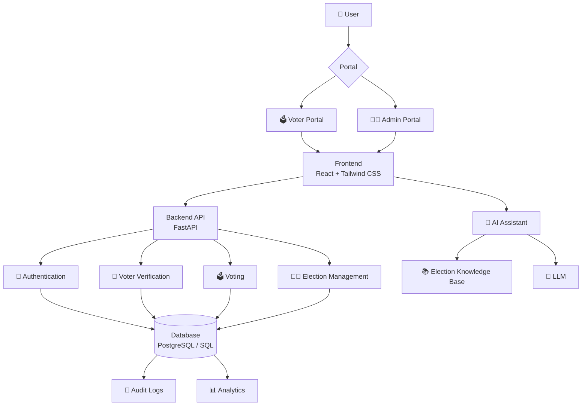
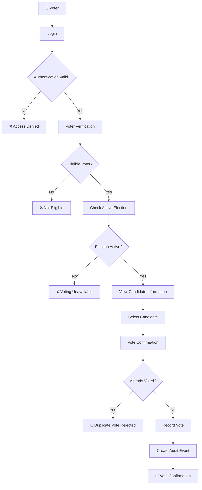
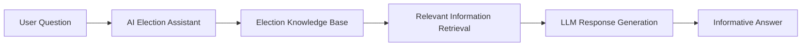
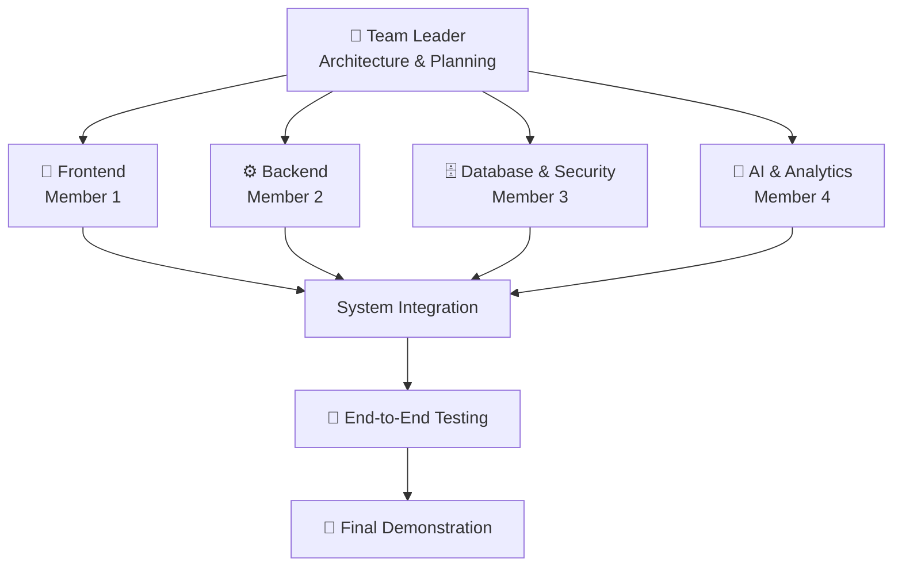

# 🗳️ AI-Based Secure Election and Intelligent Voting System

> A secure, transparent, privacy-aware, and AI-assisted digital election prototype.

**Project Status:** Prototype  
**Purpose:** Educational, Research & Demonstration

---

## 📌 Project Overview

The **AI-Based Secure Election and Intelligent Voting System** is a prototype digital election platform designed to demonstrate how modern web technologies, security mechanisms, databases, analytics, and Artificial Intelligence can improve the digital election experience.

The system focuses on:

- 🔐 Secure voter authentication
- 👤 Voter eligibility verification
- 🧑‍💼 Election and candidate management
- 🗳️ Secure vote submission
- 🚫 Duplicate-vote prevention
- 🔎 Auditability and transparency
- 🤖 AI-powered election information assistance
- 📊 Election analytics
- 🔒 Secure management of election-related data

> ⚠️ **Note:** This project is a prototype for educational and demonstration purposes. It is not intended to replace certified real-world election infrastructure.

---

# 🎯 Problem Statement

Traditional election processes can face challenges related to **security, transparency, accessibility, voter awareness, and efficient election management**.

Digital voting platforms can introduce additional concerns such as:

- Unauthorized access
- Duplicate voting
- Incorrect eligibility handling
- Poor transparency
- Inadequate auditability
- Limited access to election information
- Insecure handling of election data

### Our Objective

This project addresses these challenges by designing a modular digital election platform with:

**Security Controls + Role-Based Access + Audit Logging + Secure Voting + AI-Powered Information Assistance + Election Analytics**

---

# 💡 Proposed Solution

The proposed system provides two primary interfaces.

## 👤 Voter Portal

An authorized voter can:

1. Log in securely.
2. Complete voter verification.
3. Check election eligibility.
4. View active elections.
5. View candidate information and manifestos.
6. Ask questions to the AI Election Assistant.
7. Cast a vote.
8. Receive vote confirmation.
9. Be prevented from voting again in the same election.

## 👨‍💼 Admin Portal

An authorized administrator can:

1. Create and manage elections.
2. Manage candidates.
3. Manage voter records.
4. Monitor election activity.
5. View aggregate election analytics.
6. Review system audit logs.
7. Manage election status.

---

# ✨ Key Features

## 🔐 1. Secure Authentication

- User authentication
- Role-based access control
- Secure password hashing
- Protected backend APIs

## 👤 2. Voter Eligibility

The system checks whether a voter is **registered, verified, and eligible** before allowing participation.

## 🗳️ 3. Secure Voting

The voting workflow validates:

- User authentication
- Voter eligibility
- Election status
- Voting status

before accepting a vote.

## 🚫 4. Duplicate-Vote Prevention

A voter can cast **only one vote per election**.

Duplicate-vote prevention is enforced through both:

- Application-level logic
- Database-level constraints

## 🧑‍💼 5. Election Management

Administrators can manage:

- Elections
- Candidates
- Election schedules
- Election status
- Voter records

## 🤖 6. AI Election Assistant

The AI assistant helps users understand:

- Election rules
- Voting procedure
- Election schedule
- Candidate profiles
- Candidate manifestos
- Frequently asked questions

> The AI assistant is designed to provide neutral informational support. It does not make the final eligibility or voting decision.

## 📊 7. Election Analytics

The system provides aggregate insights such as:

- Total eligible voters
- Votes cast
- Voter turnout
- Candidate-wise vote distribution

## 🔎 8. Audit Logs

Important system events can be recorded, such as:

- Login
- Election creation
- Candidate management
- Election activation
- Vote submission
- Election closure

Audit logs support traceability without exposing unnecessary voter-choice information.

---

# 🏗️ System Architecture



---

# 🔄 Complete Voting Workflow



---

# 🤖 AI Election Assistant

The AI Election Assistant improves the overall election experience by helping users understand election-related information.

## AI Capabilities

The assistant can provide information about:

- Election rules
- Voting procedure
- Election schedule
- Candidate profiles
- Candidate manifestos
- Frequently asked questions

## AI Assistant Workflow



### Knowledge Base

The AI knowledge base contains:

- Election rules
- Candidate profiles
- Candidate manifestos
- Voting procedure
- Election schedule
- Frequently asked questions

Location:

```text
ai/
└── knowledge/
    └── election_knowledge.json
```

---

# 🗄️ Database Design

The prototype uses the following logical entities:

| Entity | Purpose |
|---|---|
| `users` | Stores authentication and role information. |
| `voters` | Stores synthetic voter eligibility and verification information. |
| `elections` | Stores election details, schedule, and status. |
| `candidates` | Stores candidate profiles and manifesto information. |
| `votes` | Stores protected vote records required for election counting. |
| `audit_logs` | Stores important system and administrative events. |

---

# 📁 Project Structure

```text
AI-Secure-Election-System/
│
├── ai/
│   ├── analytics/
│   │   └── README.md
│   ├── chatbot/
│   │   └── README.md
│   ├── knowledge/
│   │   └── election_knowledge.json
│   └── README.md
│
├── backend/
│   └── README.md
│
├── database/
│   ├── data/
│   │   ├── audit_logs.csv
│   │   ├── candidates.csv
│   │   ├── elections.csv
│   │   ├── seed_votes_for_demo.csv
│   │   ├── users.csv
│   │   └── voters.csv
│   ├── schema.sql
│   └── README.md
│
├── docs/
│   ├── architecture/
│   ├── api/
│   ├── screenshots/
│   └── README.md
│
├── frontend/
│   └── README.md
│
├── tests/
│   └── README.md
│
├── .gitignore
└── README.md
```

---

# 👥 Team Members & Responsibilities

| Role | Primary Responsibility | Module |
|---|---|---|
| 👑 Team Leader | Architecture, planning, GitHub, integration, testing | Project-wide |
| 🎨 Member 1 | Frontend development and UI | `frontend/` |
| ⚙️ Member 2 | Backend APIs and voting logic | `backend/` |
| 🗄️ Member 3 | Database and security | `database/` |
| 🤖 Member 4 | AI assistant and analytics | `ai/` |

---

## 👑 Team Leader — Integration & Project Management

### Responsibilities

- Overall system architecture
- Project planning
- GitHub repository management
- Branch and Pull Request management
- Module integration
- Security review
- End-to-end testing
- Final demonstration
- Documentation coordination

### Primary Flow

```text
Architecture
    ↓
Team Coordination
    ↓
Module Integration
    ↓
Testing
    ↓
Final Demo
```

---

## 🎨 Member 1 — Frontend Developer

### Module

```text
frontend/
```

### Responsibilities

- Voter login interface
- Voter dashboard
- Candidate listing
- Candidate details
- Voting interface
- Vote confirmation page
- AI chat interface
- Admin dashboard
- Analytics visualization

### Development Flow

```text
UI Design
    ↓
React Components
    ↓
Pages
    ↓
API Integration
    ↓
UI Testing
```

---

## ⚙️ Member 2 — Backend Developer

### Module

```text
backend/
```

### Responsibilities

- FastAPI application
- Authentication APIs
- Voter verification APIs
- Election APIs
- Candidate APIs
- Voting APIs
- Result APIs
- Audit APIs
- AI API integration
- Backend validation

### Development Flow

```text
API Design
    ↓
FastAPI Routes
    ↓
Business Logic
    ↓
Database Integration
    ↓
Validation
    ↓
Testing
```

---

## 🗄️ Member 3 — Database & Security Developer

### Module

```text
database/
```

### Responsibilities

- Database schema
- Voter data
- Election data
- Candidate data
- Vote records
- Audit logs
- Database constraints
- Duplicate-vote prevention
- Secure data handling
- Synthetic dataset integration

### Development Flow

```text
Database Schema
    ↓
Tables
    ↓
Relationships
    ↓
Synthetic Data
    ↓
Constraints
    ↓
Backend Integration
```

---

## 🤖 Member 4 — AI & Analytics Developer

### Module

```text
ai/
```

### Responsibilities

- AI Election Assistant
- Election knowledge base
- Candidate information retrieval
- Election FAQ handling
- Voting procedure assistance
- Election analytics
- Turnout calculation
- Candidate vote distribution
- AI/backend integration

### Development Flow

```text
Election Knowledge
    ↓
Knowledge Base
    ↓
Information Retrieval
    ↓
LLM
    ↓
AI Response
    ↓
Frontend Integration
```

---

# 🔄 Team Development Flow



---

# 🧪 Testing Strategy

The system should test the following areas.

## 🔐 Authentication

- Valid login
- Invalid login
- Unauthorized access

## 👤 Eligibility

- Eligible voter
- Non-eligible voter
- Unverified voter

## 🗳️ Voting

- Successful vote
- Duplicate vote attempt
- Vote after election closure
- Unauthorized vote attempt

## 🤖 AI Assistant

- Election rules question
- Candidate information question
- Voting procedure question
- Unknown / out-of-scope question

## 📊 Analytics

- Vote count
- Turnout percentage
- Candidate-wise aggregation

---

# 📊 Synthetic Dataset

This prototype uses **synthetic/demo election data rather than real voter information**.

### Dataset Contents

| Data | Description |
|---|---|
| `voters.csv` | 100 synthetic voters |
| `candidates.csv` | 5 synthetic candidates |
| `elections.csv` | 1 demo election |
| `seed_votes_for_demo.csv` | Demo vote records |
| `audit_logs.csv` | Sample audit log records |
| `users.csv` | Demo authentication/user records |
| `election_knowledge.json` | AI election knowledge base |
| Election FAQs | Information used by the AI assistant |

> 🔒 No real voter information should be used in this educational prototype.

---

# 🛠️ Technology Stack

| Layer | Technology |
|---|---|
| Frontend | React, Tailwind CSS |
| Backend | Python, FastAPI |
| Database | PostgreSQL / MySQL |
| AI | LLM API + Knowledge Base / RAG |
| Data Processing | Python, Pandas |
| Analytics | Chart.js / Plotly |
| Authentication | JWT + Password Hashing |
| Version Control | Git + GitHub |

---

# 🔐 Security Principles

The prototype follows these security principles:

- Authentication before protected operations
- Role-based authorization
- Password hashing
- Backend-side eligibility validation
- Duplicate-vote prevention
- Database constraints
- Protected API endpoints
- Audit logging
- Synthetic/demo data only
- No API keys or secrets committed to GitHub

---

# ⚠️ Prototype Disclaimer

This project is developed for **educational, research, and demonstration purposes**.

It is **not a certified election system** and should not be used for real public elections without extensive security testing, independent auditing, legal review, privacy assessment, accessibility validation, and compliance with applicable election regulations.

---

# 🚀 Future Scope

Potential future enhancements include:

- Stronger identity verification
- Multi-factor authentication
- Privacy-preserving cryptographic voting
- Tamper-evident audit infrastructure
- Advanced anomaly detection
- Accessibility improvements
- Multilingual AI assistance
- Real-time notifications
- End-to-end vote verifiability
- Independent security auditing

---

# 🌿 GitHub Development Workflow

All contributors should work through feature branches.

```text
main
│
├── frontend
├── backend
├── database
└── ai-analytics
```

### Workflow

```text
Create Branch
    ↓
Develop
    ↓
Test
    ↓
Commit
    ↓
Push
    ↓
Pull Request
    ↓
Code Review
    ↓
Merge into main
```

> ⚠️ Direct development on `main` should be avoided.

---

# 📜 License

This project is intended for **educational and demonstration purposes**.
